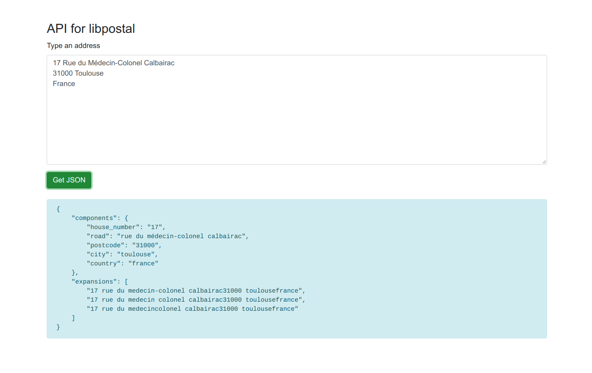

# API for libpostal

## What is this?

It is a simple API for the library libpostal that parses raw adresses.

### Example



### Install (for Ubuntu)

Install libpostal:

```
sudo apt-get install curl autoconf automake libtool pkg-config

git clone https://github.com/openvenues/libpostal
cd libpostal
./bootstrap.sh
./configure --datadir=[...some dir with a few GB of space...]
make -j4
sudo make install
sudo ldconfig
```

Install API libpostal:

```
git clone https://github.com/egorsmkv/api-libpostal.git
cd api-libpostal
cmake .
make
```

### Running

```
./api_libpostal
```

After running you can access this URL: http://127.0.0.1:8080/demo

### CURL usage

```
curl -vvvv -H "X-To-Parse: Quatre%20vingt%20douze%20R.%20de%20l%27%C3%89glise%09" http://127.0.0.1:8080/parse

curl -H "X-To-Parse: 04073%2C%20%D0%BC.%D0%9A%D0%B8%D1%97%D0%B2%2C%20%D0%9E%D0%B1%D0%BE%D0%BB%D0%BE%D0%BD%D1%81%D1%8C%D0%BA%D0%B8%D0%B9%20%D1%80%D0%B0%D0%B9%D0%BE%D0%BD%2C%20%D0%92%D0%A3%D0%9B%D0%98%D0%A6%D0%AF%20%D0%9A%D0%98%D0%A0%D0%98%D0%9B%D0%86%D0%92%D0%A1%D0%AC%D0%9A%D0%90%2C%20%D0%B1%D1%83%D0%B4%D0%B8%D0%BD%D0%BE%D0%BA%20160%2C%20%D0%BA%D0%BE%D1%80%D0%BF%D1%83%D1%81%20%D0%91" http://127.0.0.1:8080/parse
```

**Note**: you need to encode the "X-To-Parse" parameter using urlencode.
